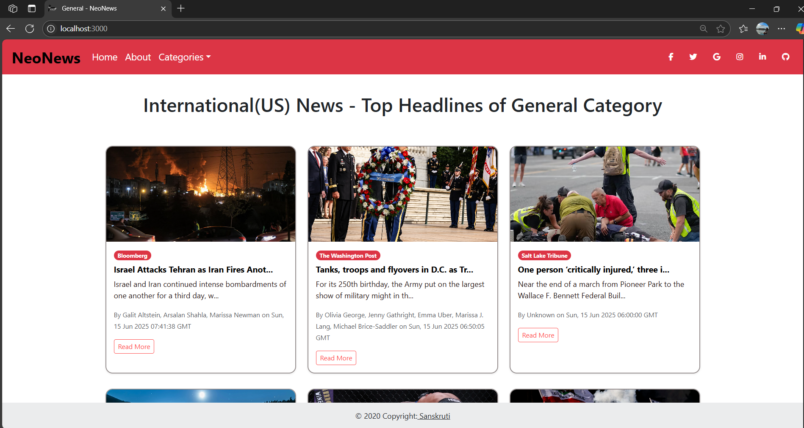
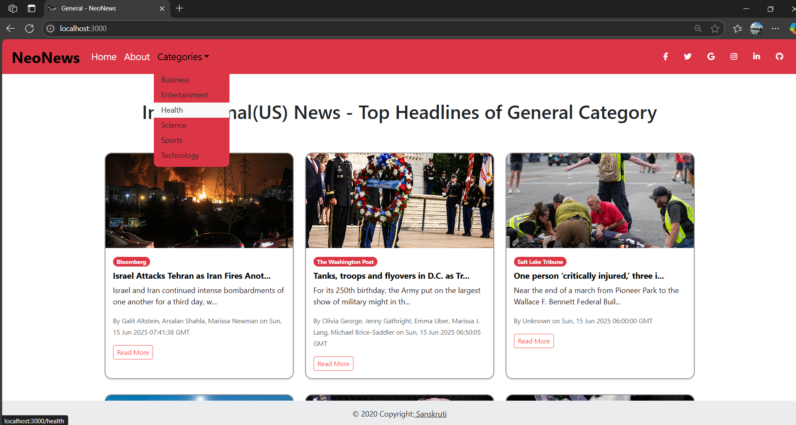

# 📰 NeoNews - The Smart News Reader App

NeoNews is a modern, responsive, and user-friendly news reading application built with React. It offers real-time breaking news, categorized news sections, and a clean, intuitive interface that ensures an enjoyable reading experience across all devices.

## 🚀 Features

- 🔥 **Breaking News in Real-Time**  
  Stay updated with the latest headlines fetched instantly from news APIs.

- 📂 **Category-wise News Browsing**  
  Easily browse news articles by categories such as World, Business, Technology, Sports, Entertainment, Health, and more.

- 📊 **Progress Bar & Loaders**  
  Smooth progress bar and loaders give users real-time feedback while content is being fetched.

- 💡 **Responsive Design**  
  Fully responsive UI designed with Bootstrap 5 ensuring seamless reading on mobile, tablet, and desktop.

- 🎯 **User-Friendly Interface**  
  Clean, simple, and intuitive UI built for best user experience.

- 🔗 **API Integration**  
  Fetches live news data using third-party news APIs.

## 🛠️ Tech Stack

- ⚛ **React JS** - Frontend Framework
- 🎨 **Bootstrap 5** - Styling & Responsive Layout
- 🌐 **News API** - For fetching live news data
- 🖌 **CSS** - Custom Styling
- 🔧 **JavaScript (ES6+)** - Application Logic

## 📸 Screenshots

## 🔑 Prerequisites

- Node.js (v14 or higher recommended)
- npm or yarn

## 📦 Installation

1. Clone the repository:
- git clone https://github.com/san-soni30/NewsApp.git

2. Navigate into the project directory:
- cd newsapp

3. Install dependencies:
- npm install

Create a .env file (if API key is required) and add your News API key:

- REACT_APP_NEWS_API_KEY=your_api_key_here
Start the development server:
- npm start

⚠️ Note
Make sure to handle your API key securely.

This project is for educational/demo purposes and may require additional error handling for production use.

🙌 Acknowledgments
- NewsAPI.org
- React, Bootstrap & the open-source community.

⭐ Feel free to star the repo if you like this project!
